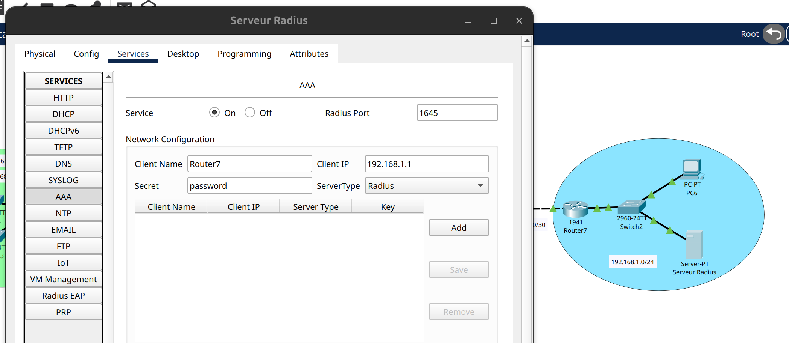
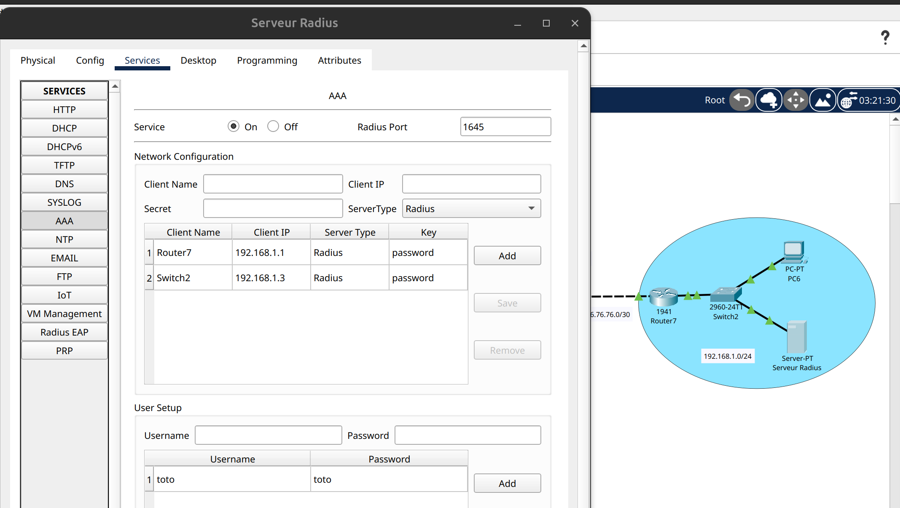

# Advanced_LAB_Part_2

<aside>
💡

Toute la configuration précédente à été effectué dans le lab précédent même si entre temps  du nouveau matériel et des config basique ont été apportés voir modifiés pour les différents points abordés de ce lab ( serveurs Web, Radius etc…)

PS : repartez du fichier fournit dans le repo pour éviter les conflits.

## Sommaire

- [Radius-AAA-Admin](#Radius-AAA-Admin)
- [Radius-AAA-Users](#Radius-AAA-Users )
- [DHCP Snooping](#DHCP-Snooping)
- [ARP Poisoning](#ARP-Poisoning)
- [DMZ](#DMZ)

</aside>

```xml
# Commandes utiles

# Voir les interfaces
Switch#sh ip int brief

# Voir la table des adresses MAC 
Switch#sh mac address-table

# Voir les ACL
Router#sh ip access
```

## Radius-AAA-Admin

> Le seveur radius et le switch ont déjà une adresse IP (statique) exclues de la rnge du DHCP du Router7

<aside>
💡

> Tout les équipements réseaux qui doivent utiliser Radius doivent être renseigné dans le serveur, ex : je veux me connecter à cet équipement avec ce compte définit dans Radius alors je dois configurer l’équipement en question

> Router, switch … ⇒ **Dans un but d’administration (via SSH ou Telnet)**

> **Attention** : les adresses IP sont obtenues via DHCP et les IP ont leur importances pour le serveur Radius au niveau des équipements réseau alors vérifié la config sinon aller voir en Annex pour modifier le serveur Radius ( facile ).

</aside>

### Switch2

> Il faut donc ajouté une IP au switch (qui sera renseigné dans la config du serveur radius)

```xml
Switch(config)#int vlan 1
Switch(config-if)#ip address 192.168.1.100 255.255.255.0
Switch(config-if)#no shutdown
Switch(config-if)#exit
```

```xml
Switch(config)#aaa new-model
Switch(config)#radius-server host 192.168.1.2 key password
Switch(config)#aaa authentication login default group radius
Switch(config)#aaa authentication enable default group radius
Switch(config)#exit
```

<aside>
💡

> Une fois configurer on peut configurer notre switch à distance avec un compte Radius (toto : toto); on peut faire “telnet 192.168.1.100” ( 192.168.1.100 étant l’ip du switch)

</aside>

### Router7

```xml
Router(config)#aaa new-model
Router(config)#radius server Main
Router(config-radius-server)#address ipv4 192.168.1.2
Router(config-radius-server)#key password
Router(config-radius-server)#aaa authentication login default group radius
Router(config)#aaa authentication enable default group radius
```

## Radius-AAA-Users

### Switch2

> Une partie de la configuration est commune à celle précédente (ou je spécifie qui est le serveur Radius) donc je ne la refais pas
>
> Switch(config)#aaa new-model
> Switch(config)#radius-server host 192.168.1.2 key password

```xml
Switch(config)#aaa authentication dot1x default group radius
Switch(config)#dot1x system-auth-control
Switch(config)#int fa0/2
Switch(config-if)#switchport mode access
Switch(config-if)#switchport access vlan 1
Switch(config-if)#authentication port-control auto
Switch(config-if)#dot1x pae authenticator
Switch(config-if)#no shutdown
Switch(config-if)#exit
```

<aside>
💡

> On doit configurer TOUS les ports que l’on veut sécurisé, dans notre cas on ne fait que fa0/2 car on a que ce pc connecté au switch.

</aside>

### PC 6

Il faut aller dans “Desktop” → “IP Configuration” → 802.1x

Puis ajouté le user/mdp créé dans le serveur Radius ( login : toto ; mdp : toto )

## DHCP Snooping

<aside>
💡

> On empeche des réponses DHCP provennant d’une machine tiers sur le réseau. Un serveur DHCP en plus mettrait notre réseau à plat (mauvaise config ou intentionnelle)

</aside>

### Switch1(1)

```xml
Switch(config)#ip dhcp snooping
Switch(config)#ip dhcp snooping vlan 10
Switch(config)#int f0/1-3
Switch(config-if)#ip dhcp snooping trust
```

> Interface f0/1 est l’interface du switch connecté au routeur, les réponses et les requêtes dhcp peuvent passer par ces ports uniquement.

> La mise en place de cette sécurité permet aussi de lutter contre les usurpations d’ip addrésser dynamiquement car le switch sait quelle IP correspond à quelle MAC et va drop les réponse ARP avec les MACs malveillantes sur le réseau.

## ARP Poisoning

> Dans un premier temps on va désactiver tout les ports qui ne sont pas utilisés pour éviter qu’un attaquant se branche sur le switch.

### Swtich1

```xml
Switch1(config)#int range f0/5-24
Switch(config-if)#shutdown
Switch(config-if)#exit
Switch1(config)#int g0/1-2
Switch(config-if)#shutdown
Switch(config-if)#exit
```

```xml
Switch(config)#int f0/1-4
Switch(config-if-range)#switchport port-security mac-address sticky
Switch(config-if-range)#switchport port-security maximum 1
Switch(config-if-range)#switchport port-security violation protect
Switch(config-if-range)#switchport port-security
```

<aside>
💡

> On aurait pu configurer ca autrement en configurant directement sur chaque port l’adresse mac des machines. Cependant ici on a un petit coté dynamique, la premiere MAC apprise est celle qui va resté et il y a plusieurs options de réponse a une “violation” on choisit protect qui drop les paquets provenant d’une MAC différente.

</aside>

## DMZ

<aside>
💡

> Avant de réaliser la DMZ il a fallu ajouté une interface (extension) GigaEthernet au routeur et donc l’éteindre sauf qu’il faut sauvegarder sa configuration “running config” dans la startup config (celle du démarrage) ; soit “write memory” soit “copy running-config startup-config”

</aside>

### Router0 (NAT)

```xml
Router(config)#ip nat inside source static tcp 10.10.10.2 80 30.30.30.2 80
Router(config)#ip nat inside source static tcp 10.10.10.2 443 30.30.30.2 443
Router(config)#ip nat inside source static 10.10.10.2 30.30.30.2 
```

> On fait de la redirection de port vers notre server web pour le http (80) et le https (443)

> On fait de la translation d’adresse ( NAT Statique 1:1) pour que les réponses de notre server prenne l’ip publique du routeur en IP source car on ne vas pas router un paquet avec une ip source publique car personne sur le réseau ne pourra répondre ou même comprendre c’était la réponse à quelle requête.

### Router0 (ACL)

```xml
Router(config)#ip access-list extended dmz-in
Router(config-ext-nacl)#permit tcp  any host 30.30.30.2 eq 80
Router(config-ext-nacl)#permit tcp  any host 30.30.30.2 eq 443
Router(config-ext-nacl)#permit tcp any host 30.30.30.2 established
Router(config-ext-nacl)#permit icmp any host 30.30.30.2 echo-reply
Router(config-ext-nacl)#exit

Router(config)#int s0/0/0
Router(config-if)#ip access-group dmz-in in
Router(config-if)#exit

Router(config)#ip access-list extended dmz-out
Router(config-ext-nacl)#permit tcp any any established
Router(config-ext-nacl)#permit icmp any any echo-reply
Router(config-ext-nacl)#exit

Router(config)#int g0/0
Router(config-if)#ip access-group dmz-out in
Router(config-if)#exit

```

<aside>
💡

> On a créé des ACL étendues pour pouvoir faire du filtrage sur le port (coté publique) de notre Routeur0.

> Ici on autorise le traffique HTTP et HTTPS à passer ( 2 premieres lignes permit).

> Les deux dernieres lignes permit c’est pour nos pc du lan 192.168.1.0/25 et 192.168.1.128/25 afin de pouvoir pinguer le reste du monde et de se connecter à des serveurs.

> Attention : par défaut a la fin d’une ACL on a un deny any ⇒ tout ce qui n’est pas autorisé est interdit !

> L’ ACL étendue dmz-out permet de filtrer les paquets enovyé depuis le serveur dans un soucis de protéger notre LAN ( réseau vert ).

> On va permettre a nos pc de joindre le serveur sur son IP privé (en HTTP et HTTPS) ainsi que de le pinguer mais tout le reste est interdit pour pas qu’un attaquant puisse rebondir sur le serveur et attaquer notre LAN.

</aside>

# Informations

<aside>
💡

> Je ferais une suite encore à ce lab dans une partie 3 ou j’irais plus loin sur la sécurité avec d’autres ACL étendues, des tunnels etc…

</aside>

## Annexes

> Comme il n’est pas intérressant de configurer notre serveur Radius sur Cisco Packet Tracer la configuration est déja faites (configuration graphique )

> Dans la partie Network Configuration on ajoute les équipements réseaux qui vont utiliser le serveur Radius donc à minima le switch mais si on veut s’authentifier au routeur avec un compte user définit dans radius alors on l’ajoute aussi



> Dans la partie User Setup on met les compte user/mdp que l’on va utiliser sur nos PC.


